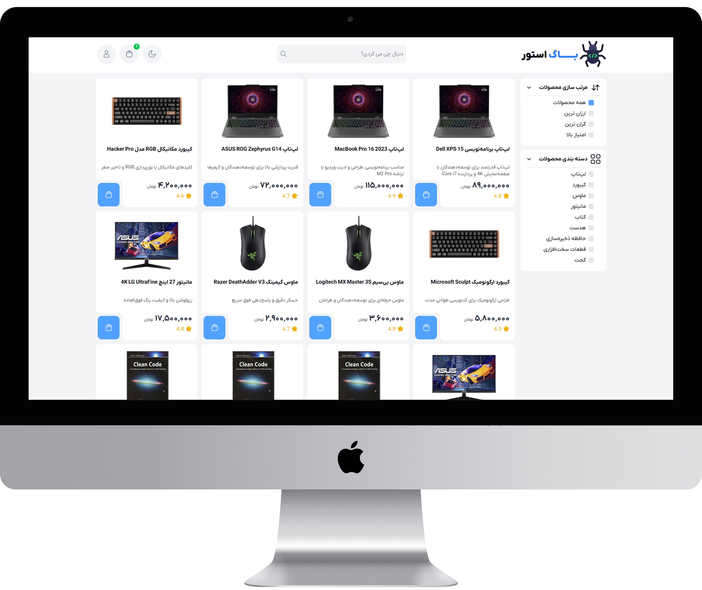
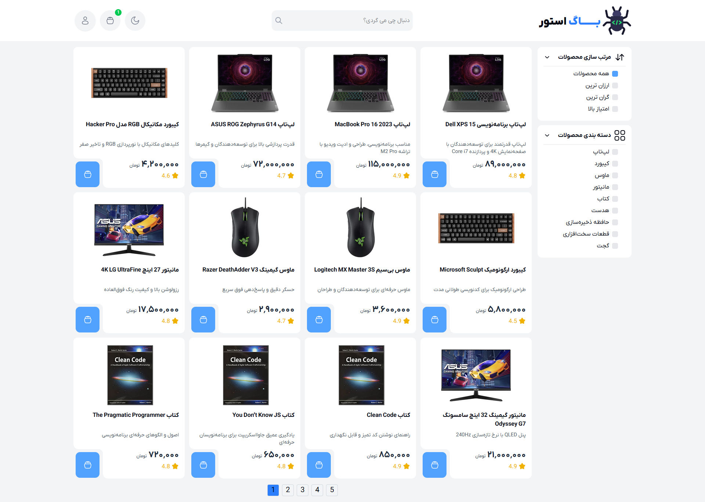
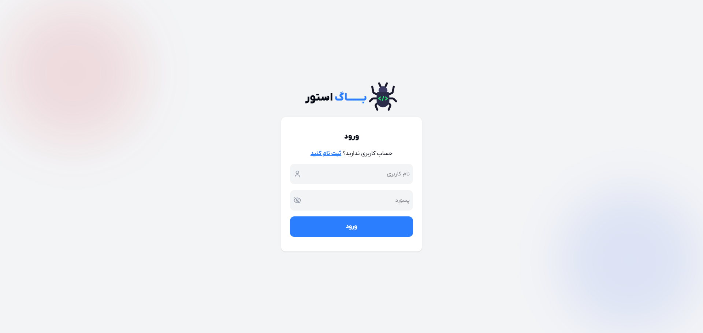
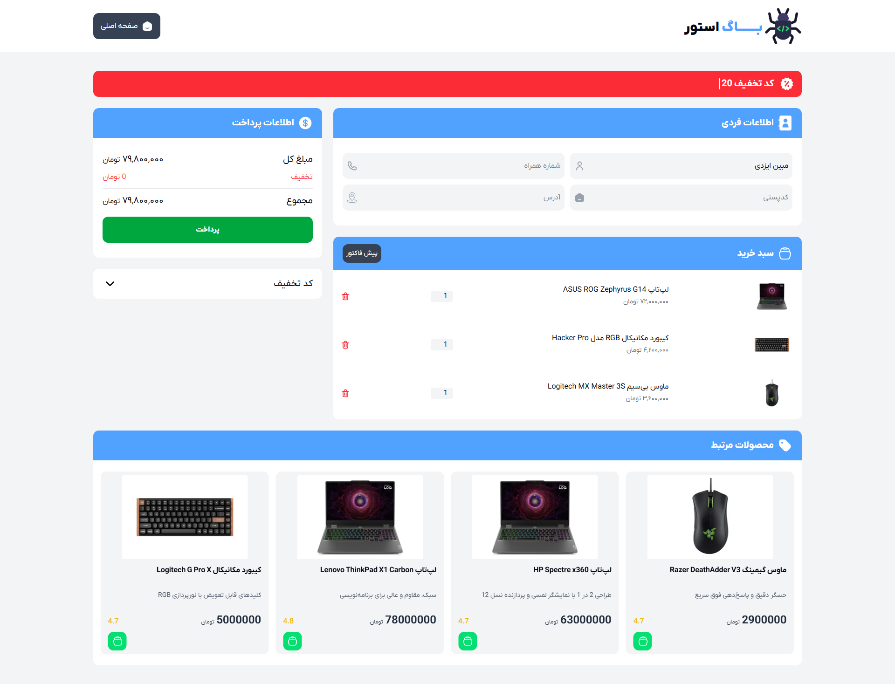
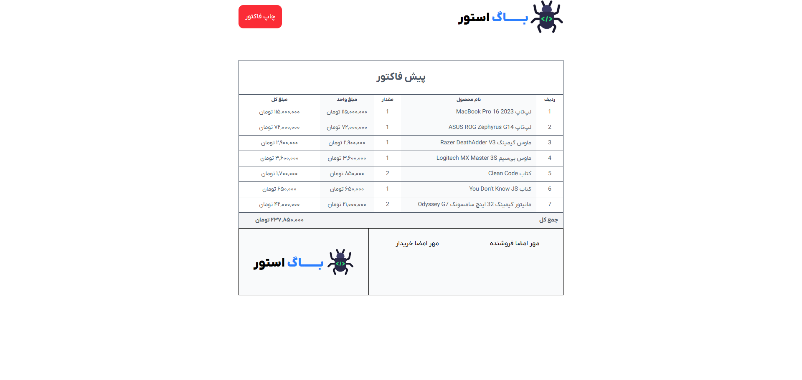

  

# 🛒 پروژه سبد خرید حرفه‌ای  

این پروژه یک **سبد خرید کامل و حرفه‌ای** است که با جاوااسکریپت خام و طراحی کاملاً ریسپانسیو پیاده‌سازی شده. هدف از این پروژه، شبیه‌سازی یک فروشگاه آنلاین با قابلیت‌های متنوع و کاربردی است.  

---

## 🚀 ویژگی‌ها  
- 🎨 طراحی زیبا و **کاملاً ریسپانسیو**  
- 🔑 **ثبت‌نام و ورود کاربر** با اطلاعات نام، نام خانوادگی، نام کاربری و رمز عبور  
- 👤 **شناسایی وضعیت کاربر** (نمایش خوشامدگویی در صورت ورود یا نمایش دکمه ورود/ثبت‌نام)  
- 🛍️ **نمایش محصولات فروشگاه** با جزئیات (عکس، قیمت، امتیاز، توضیحات و …)  
- ➕ **افزودن محصول به سبد خرید**  
- ✅ **اعتبارسنجی ورودی‌ها (Validation)**  
- 🔄 جلوگیری از افزودن محصول تکراری (فقط افزایش موجودی در سبد)  
- 📊 **افزایش/کاهش موجودی هر محصول** در سبد خرید  
- 💰 **محاسبه قیمت کل سبد خرید**  
- 🧾 **صدور فاکتور خرید در قالب PDF**  
- 📑 **صفحه‌بندی (Pagination)** محصولات  
- 🚪 **قابلیت خروج (Logout)** و حذف توکن کاربر  
- 💾 **ذخیره‌سازی سبد خرید در LocalStorage** (حتی بعد از خروج کاربر حفظ می‌شود)  
- 🎟️ **اعمال کد تخفیف** روی مبلغ کل  
- 🌗 **تغییر تم (Dark/Light)** با ذخیره‌سازی در LocalStorage  
- 📦 **بررسی موجودی انبار** هنگام افزودن محصول  
- 🔗 **نمایش محصولات مرتبط** بر اساس انتخاب کاربر  
- 🗂️ پشتیبانی از حداقل **۵۰ محصول** در فروشگاه  
- ...

---

## 🛠️ تکنولوژی‌ها  
- **HTML5**  
- **CSS3** (Tailwind / Custom CSS)  
- **Vanilla JavaScript**  

---

## 📄 صفحات پروژه  
- 🏠 **صفحه اصلی** → نمایش محصولات به همراه صفحه‌بندی 

  
- 🔑 **صفحه ثبت‌نام / ورود** → ایجاد حساب کاربری و ورود به سیستم  

 
 
- 🛒 **صفحه سبد خرید** → مشاهده محصولات انتخابی، مدیریت موجودی، اعمال کد تخفیف  

 
- 🧾 **صفحه فاکتور** → مشاهده و دانلود فاکتور خرید در قالب PDF  

 

---
