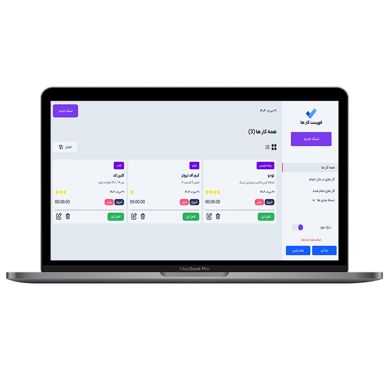

  

# 📝 Todo List Project

یک پروژه **Todo List** کاربردی که با استفاده از **HTML, CSS,
JavaScript** توسعه داده شده است.\
این پروژه قابلیت مدیریت کارها (اضافه کردن، حذف، ویرایش، تکمیل و ...) را
دارد و علاوه بر این، امکانات پیشرفته‌ای مثل تغییر تم، فیلترگذاری، تایمر و
بکاپ‌گیری هم پیاده‌سازی شده است.

------------------------------------------------------------------------

## ✨ ویژگی‌ها

-   🎨 طراحی **کاملاً ریسپانسیو** و رابط کاربری زیبا\
-   ➕ امکان **اضافه کردن کارها (Todo)**\
-   ➕ امکان **اضافه کردن دسته بندی **\
-   🗑️ قابلیت **ویرایش و حذف** کارها\
-   ✅ علامت‌گذاری کارها به‌عنوان **انجام‌شده (Done)**\
-   🌓 **تغییر تم (Dark / Light)** همراه با ذخیره‌سازی در LocalStorage\
-   📂 ذخیره و بازیابی کارها با **LocalStorage** حتی بعد از رفرش\
-   🎯 تعیین سطح سختی برای هر Todo (از 1 تا 5)\
-   📑 امکان **دسته‌بندی کارها** و فیلترکردن بر اساس وضعیت یا سختی\
-   ⏱️ **تایمر اختصاصی** برای هر کار (Start, Stop, Resume)\
-   📤 خروجی گرفتن از کارها در قالب **JSON  / CSV**\
-   💾 قابلیت **بکاپ‌گیری و بازیابی** کارها\
-   ⚡ دارای **Loader** قبل از بارگذاری صفحه

------------------------------------------------------------------------

## 🛠️ تکنولوژی‌های استفاده‌شده

-   **HTML5** 
-   **CSS3** 
-   **JavaScript (ES6)**

------------------------------------------------------------------------

